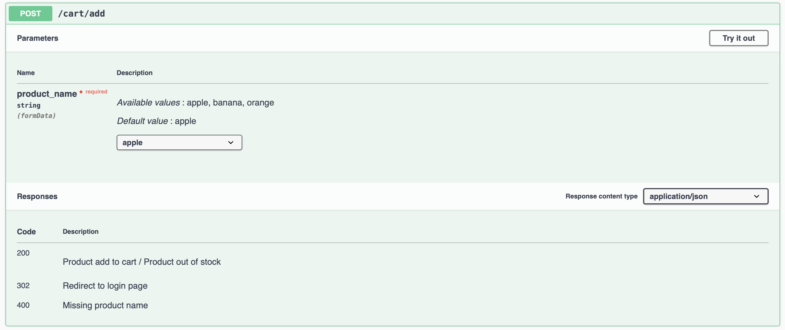

# Shopping Cart API Server
Shopping Cart API Server is a RESTFUL API Server based on Flask and use sqlite as database.

## APIs
- Add item to cart (API)
- Checkout from current cart (API)

## Installation (Local)
```
pip install -r requirements.txt
```
### Run Server
```
# /bin/bash
# 1.move to project dir
cd project
# 2.create demo database
python init_db.py
# 3.run flask server
python app.py
```


## Installation (Docker)
### Run Server
```
sudo docker run --rm -d -p 8000:8000 --name shopping_cart rejectsgallery/demo:sc-1.0
```

### Swagger Docs URL
```
http://127.0.0.1:8000/apidocs/#/default
```
### API Table


### Test Flow (Swagger)
1. /account/login

2. /cart/add

3. /cart/checkout


## File Layout


## Pytest APIs & Functions
```
cd project
pytest
```
